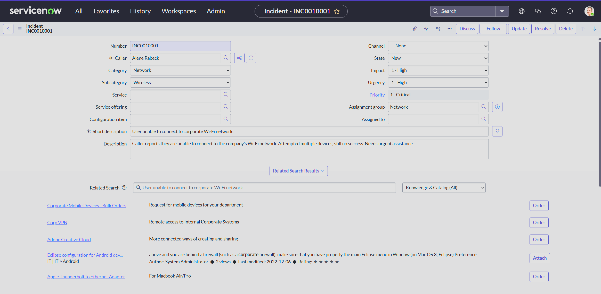
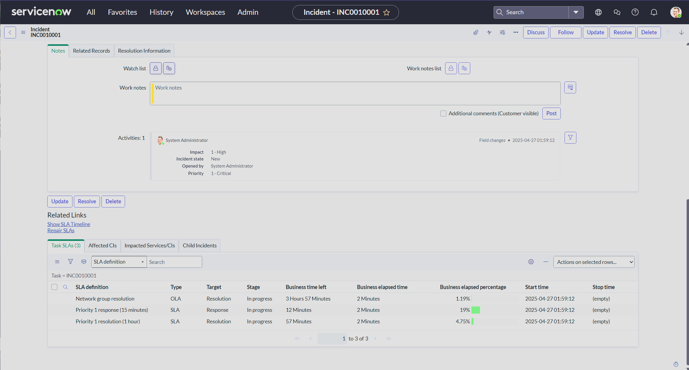

# ServiceNow - Helpdesk Ticket Management 🚑

---

##  Description
This project demonstrates basic ticket creation inside ServiceNow...

## Ticket Details
- **Issue:** User unable to connect to corporate Wi-Fi network
- **Priority:** 1 - Critical
- **Assignment Group:** Network
- **Category:** Network → Wireless

## Screenshots

---

This simulates real-world helpdesk operations such as:
- Proper ticket categorization
- Priority and urgency setting
- Short and full description drafting
- Correct assignment to support groups
